```mermaid
flowchart LR
  subgraph Browser["User Browser"]
    U[User]
    SPA["MindMatch SPA<br/>React + TypeScript + Vite"]
    LS[("LocalStorage<br/>session id + answers/context<br/>recent questions + result history<br/>pending retake avoidance")]
    U --> SPA
    SPA <--> LS
  end

  subgraph Frontend["Frontend Runtime"]
    Router["React Router<br/>/, /quiz, /results<br/>+ /loading, /results2"]
    Quiz["Adaptive Quiz Engine<br/>core + adaptive questions<br/>personality + today + confidence"]
    Results["Results Experience<br/>retake flow + click feedback<br/>profile/movie radar + reasons"]
    API["API Client<br/>postRecommend + postEvent + getHealth"]
    SPA --> Router
    Router --> Quiz
    Router --> Results
    Quiz --> API
    Results --> API
  end

  subgraph Backend["Backend API<br/>Flask + Gunicorn"]
    Health["GET /health"]
    Recommend["POST /recommend"]
    Event["POST /event"]

    Profile["Profile Builder<br/>answers_to_traits + summarize_traits"]
    Retrieve["Catalog Retrieval<br/>centered cosine + TF-IDF<br/>query text from traits/context"]
    Score["Request-Time Ranking<br/>trait + text + feedback + session<br/>popularity/novelty/comfort bonuses"]
    Guards["Guardrails<br/>relevance floor + repeat penalties<br/>explicit retake avoidance"]
    Explore["Sampled Rerank Pool<br/>deterministic exploration band"]
    Diversify["MMR Diversify<br/>genre + franchise + overlap controls"]
    Display["Display Fit Score<br/>absolute hybrid relevance for UI"]
    Enrich["Fallback Enrichment<br/>TMDb poster/meta fill"]
    Shown["Auto 'shown' Event Logging"]
    Feedback["Event Persistence + LinUCB Updates<br/>feedback stored live<br/>snapshots updated on /event"]
  end

  subgraph Data["Data Stores"]
    Catalog[("SQLite Catalog<br/>movies_core.db default<br/>movies_curated1500.db optional<br/>custom MOVIES_DB path supported")]
    Cache[("In-Memory Cache<br/>catalog records + TF-IDF matrix")]
    Events[("SQLite Event DB<br/>events + linucb_snapshots")]
  end

  subgraph External["External Integrations"]
    TMDB["TMDb API"]
    Ingest["tmdb_ingest.py<br/>catalog builder"]
  end

  API -->|GET| Health
  API -->|POST answers + context + session_id| Recommend
  API -->|POST click/save/finish/dismiss| Event

  Recommend --> Profile --> Retrieve --> Score --> Guards --> Explore --> Diversify --> Display --> Enrich --> Shown
  Event --> Feedback --> Events
  Shown --> Events

  Catalog --> Cache --> Retrieve
  Events -. feedback priors + exposure history .-> Score
  Events -. shown dedupe .-> Shown

  Enrich -. optional fallback .-> TMDB
  Ingest --> Catalog
```

Notes:
- Historical events influence active recommendation scoring through feedback priors, session adjustments, repeat suppression, and exposure penalties.
- LinUCB snapshots are updated on `/event`, but they are not used directly in the current `/recommend` scoring path.
