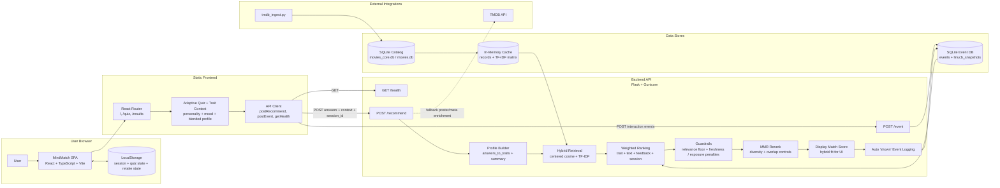

```mermaid
flowchart LR
  subgraph Browser["User Browser"]
    U[User]
    SPA["MindMatch SPA<br/>React + TypeScript + Vite"]
    LS[("LocalStorage<br/>session + quiz state + retake state")]
    U --> SPA
    SPA <--> LS
  end

  subgraph Frontend["Static Frontend"]
    Router["React Router<br/>/, /quiz, /results"]
    QuizEngine["Adaptive Quiz + Trait Context<br/>personality + mood + blended profile"]
    APIClient["API Client<br/>postRecommend, postEvent, getHealth"]
    SPA --> Router --> QuizEngine --> APIClient
  end

  subgraph Backend["Backend API<br/>Flask + Gunicorn"]
    Health["GET /health"]
    Recommend["POST /recommend"]
    Event["POST /event"]

    Profile["Profile Builder<br/>answers_to_traits + summary"]
    Retrieval["Hybrid Retrieval<br/>centered cosine + TF-IDF"]
    Rank["Weighted Ranking<br/>trait + text + feedback + session"]
    Guards["Guardrails<br/>relevance floor + freshness / exposure penalties"]
    MMR["MMR Rerank<br/>diversity + overlap controls"]
    Display["Display Match Score<br/>hybrid fit for UI"]
    Shown["Auto 'shown' Event Logging"]
  end

  subgraph Data["Data Stores"]
    Catalog[("SQLite Catalog<br/>movies_core.db / movies.db")]
    Cache[("In-Memory Cache<br/>records + TF-IDF matrix")]
    Events[("SQLite Event DB<br/>events + linucb_snapshots")]
  end

  subgraph External["External Integrations"]
    TMDB["TMDB API"]
    Ingest["tmdb_ingest.py"]
  end

  APIClient -->|GET| Health
  APIClient -->|POST answers + context + session_id| Recommend
  APIClient -->|POST interaction events| Event

  Recommend --> Profile --> Retrieval --> Rank --> Guards --> MMR --> Display --> Shown

  Catalog --> Cache --> Retrieval
  Events --> Rank
  Event --> Events
  Shown --> Events

  Recommend -. fallback poster/meta enrichment .-> TMDB
  Ingest --> Catalog
```
